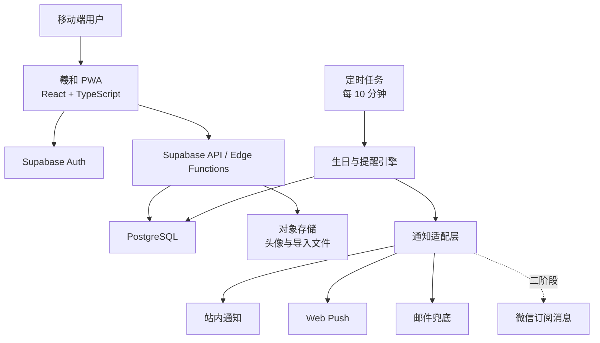

# 羲和 MVP 技术方案 v0.1

状态：待确认  
目标：把已验证的移动端交互原型升级为可真实录入、保存和提醒的 MVP。

## 1. 结论先行

首版采用“移动端 PWA + Supabase 托管后端 + PostgreSQL + 定时任务”的轻量架构。前端继续沿用现有 React 原型，避免重做视觉与交互；后端优先使用托管能力快速验证真实使用，再根据国内部署、微信接入和企业客户需求决定是否迁移到腾讯云或自建服务。

MVP 的最小闭环是：

> 注册/登录 → 录入或导入生日 → 分组整理 → 提前 3 天/当天提醒 → 祝福或联系 → 标记已关心

微信通知不作为首版上线阻塞项。首版先完成站内提醒、浏览器/系统通知和邮件兜底，同时用独立通知适配层预留微信公众号或小程序订阅消息。

## 2. 范围

### 2.1 MVP 必须实现

- 邮箱验证码或魔法链接登录。
- 人物的新增、编辑、归档和删除。
- 公历生日、农历生日、未知出生年份。
- 自定义分组，一人可属于多个分组。
- CSV/XLSX 导入、字段映射、预览、去重和错误反馈。
- 默认“提前 3 天 + 当天 09:00”提醒，可按人物调整。
- 首页显示当天和未来三天生日。
- 祝福文案、联系、礼物待办和“已关心”记录。
- 数据导出、账号注销和隐私说明。
- 移动端 PWA，可添加到手机桌面。

### 2.2 首版暂不实现

- 自动读取全部手机通讯录。
- 自动向亲友发送微信消息。
- 企业多租户、审批和复杂权限。
- 礼品商城、积分、公开社交关系链。
- 微服务、消息队列、Redis 或 Kubernetes。
- 不经用户确认的 AI 自动发送祝福。

## 3. 非功能要求

| 类别 | MVP 目标 |
|---|---|
| 用户规模 | 首批 1,000 名用户，每人不超过 500 位人物 |
| 页面性能 | 4G 网络下首屏 3 秒内可用，常用操作即时反馈 |
| API 性能 | 读取类接口 p95 小于 500 ms |
| 提醒可靠性 | 计划时间后 10 分钟内完成投递；失败可重试、可查询 |
| 可用性 | 月度 99.5%，以小规模试用为目标 |
| 数据恢复 | 每日备份；RPO 24 小时，RTO 4 小时 |
| 隐私 | 默认私有、最少采集、可导出、可删除 |
| 可维护性 | 单仓库、模块化边界、自动化迁移和基础测试 |

## 4. 总体架构

架构模式采用模块化单体：单个前端应用、单个 PostgreSQL 数据库、少量边缘函数和定时任务。领域按账号、人物、生日、分组、导入、提醒、关怀记录分模块，在不增加部署复杂度的前提下保持边界清晰。

## 5. 技术选型

### 5.1 前端

- React + TypeScript + Vite。
- PWA：Service Worker、离线壳、桌面安装和 Web Push 订阅。
- 状态与请求：TanStack Query；表单使用 React Hook Form + Zod。
- 动效：GSAP 仅用于日光轨迹、时间轴进入和完成反馈；支持 `prefers-reduced-motion`。
- 日期：date-fns 处理公历；农历采用经过用例验证的独立转换库，并封装为领域服务。

### 5.2 后端

- Supabase Auth：邮箱验证码/魔法链接。
- PostgreSQL：人物、分组、提醒和关怀记录具有明确关系，适合关系型数据库与事务。
- Row Level Security：确保用户只能访问自己的数据。
- Edge Functions：文件导入、提醒任务、通知发送和数据导出。
- Supabase Cron 或外部 Cron：每 10 分钟扫描待发送提醒。

### 5.3 部署

- MVP：前端部署至支持 HTTPS 的静态托管平台；后端使用 Supabase 托管环境。
- 国内正式上线前进行网络可达性验证。
- 若 Supabase 在目标用户网络下不稳定，保留迁移方案：腾讯云轻量应用服务器/云函数 + 托管 PostgreSQL + COS。

## 6. 数据模型

### 6.1 核心实体

| 表 | 关键字段 | 说明 |
|---|---|---|
| `profiles` | `id`, `display_name`, `timezone`, `locale` | 与认证用户一一对应 |
| `people` | `id`, `user_id`, `name`, `relationship`, `avatar_url`, `notes`, `archived_at` | 用户维护的重要人物 |
| `birthdays` | `id`, `person_id`, `calendar_type`, `year`, `month`, `day`, `leap_month_rule` | 生日规则，年份允许为空 |
| `groups` | `id`, `user_id`, `name`, `color`, `sort_order` | 自定义分组 |
| `person_groups` | `person_id`, `group_id` | 人物与分组多对多 |
| `reminder_rules` | `id`, `person_id`, `days_before`, `send_time`, `channels`, `enabled` | 人物提醒配置 |
| `notification_jobs` | `id`, `user_id`, `person_id`, `scheduled_at`, `channel`, `status`, `attempts`, `dedupe_key` | 可重试、可审计的通知任务 |
| `care_records` | `id`, `person_id`, `action_type`, `content`, `completed_at` | 祝福、联系、礼物与完成记录 |
| `import_batches` | `id`, `user_id`, `file_name`, `status`, `summary` | 一次文件导入 |
| `import_rows` | `id`, `batch_id`, `row_no`, `raw_data`, `status`, `error_message` | 导入预览与错误定位 |
| `push_subscriptions` | `id`, `user_id`, `channel`, `endpoint`, `status` | 用户的通知终端 |

### 6.2 关键约束

- 所有业务表均包含用户归属或可通过关系追溯用户归属。
- `people(user_id, normalized_name)` 建普通索引，不强制唯一，避免同名人物冲突。
- `notification_jobs.dedupe_key` 唯一，防止同一人物、日期、渠道重复发送。
- 删除账号时使用后台任务清理关联数据与对象存储。
- 导入原始文件短期保存，默认 24 小时后删除。

## 7. 核心流程

### 7.1 新增人物

前端校验 → 写入人物 → 写入生日规则 → 创建默认提醒规则 → 刷新未来三日视图。

### 7.2 文件导入

上传文件 → 解析表头 → 用户确认字段映射 → 行级校验 → 计算潜在重复 → 用户确认合并/跳过 → 事务写入 → 返回成功与错误摘要。

去重采用多信号评分，不自动覆盖：标准化姓名、生日月日、手机号后四位（如用户主动提供）和所属分组。低置信度记录必须由用户确认。

### 7.3 提醒任务

1. 每天生成未来 7 天的候选任务。
2. 将农历生日换算为当前公历日期。
3. 按用户时区计算实际发送时间。
4. 写入带唯一去重键的 `notification_jobs`。
5. 每 10 分钟拉取到期任务并发送。
6. 成功标记 `sent`；失败指数退避重试 3 次，之后标记 `failed` 并在应用内提示。

### 7.4 微信接入

微信不允许普通网页任意向个人微信发送消息。二阶段需要在以下方案中选择：

- 微信小程序订阅消息：用户主动授权，适合中国移动端场景，但模板、频次和触达受平台规则限制。
- 公众号服务通知：需要合规主体、用户关注及 OpenID，能力受账号类型和平台审核影响。
- 企业微信应用消息：适合公司内部员工关怀，不适合个人亲友场景。

通知适配层统一使用 `send(job)` 接口，微信接入不修改核心生日与任务模型。

## 8. API 草案

| 方法 | 路径 | 用途 |
|---|---|---|
| GET | `/people?group=&query=` | 人物列表、搜索和筛选 |
| POST | `/people` | 新增人物与生日规则 |
| PATCH | `/people/:id` | 编辑人物、生日和备注 |
| DELETE | `/people/:id` | 软删除/归档人物 |
| GET | `/upcoming?days=3` | 当天与未来三天生日 |
| POST | `/groups` | 新建分组 |
| POST | `/imports` | 上传并创建导入批次 |
| POST | `/imports/:id/preview` | 字段映射、校验与去重预览 |
| POST | `/imports/:id/commit` | 确认导入 |
| PUT | `/people/:id/reminders` | 更新提醒规则 |
| POST | `/people/:id/care-records` | 记录祝福、联系或礼物动作 |
| GET | `/notifications/health` | 检查通知权限与失败任务 |
| POST | `/exports` | 导出用户数据 |

前端可优先直接使用 Supabase SDK；涉及导入、提醒、通知和导出的操作必须通过服务端函数，避免把关键规则散落在客户端。

## 9. 安全与隐私

- 全站 HTTPS，认证令牌使用短时访问令牌和安全刷新机制。
- PostgreSQL 开启 RLS；任何查询都必须验证 `auth.uid()` 与数据归属。
- 文件限制类型、大小与行数，解析在隔离函数中进行，防止公式注入和恶意文件。
- 日志不记录完整生日、备注、令牌或推送端点。
- 头像使用签名 URL 或私有桶。
- 提供数据导出、账号注销、通知退订和权限用途说明。
- AI 祝福默认由用户主动触发；发送前必须由用户确认。

## 10. 失败模式与处理

| 故障 | 用户影响 | 应对策略 |
|---|---|---|
| 定时任务未运行 | 漏发提醒 | 健康检查、任务水位监控、补偿扫描 |
| 同一任务重复执行 | 重复提醒 | 唯一去重键与幂等发送 |
| 农历换算错误 | 日期错误 | 固定测试用例、闰月策略显式保存、人工校正入口 |
| Web Push 权限关闭 | 无系统通知 | 站内状态提示、邮件兜底、重新授权指引 |
| 文件格式异常 | 无法导入 | 行级错误提示、可下载错误清单、已通过行仍可导入 |
| Supabase 网络不稳定 | 登录或同步失败 | 本地缓存、重试提示、国内部署迁移预案 |
| 微信接口规则变化 | 微信通知失效 | 适配层隔离、保留系统通知与邮件通道 |

## 11. 可观测性

- 结构化日志：请求 ID、任务 ID、状态和错误码，不记录敏感正文。
- 核心指标：提醒生成数、发送成功率、失败重试数、导入成功率、重复合并率。
- 告警：定时任务 20 分钟无心跳、失败率超过阈值、任务积压超过阈值。
- 用户侧提供“通知健康检查”，展示权限、订阅端点和最近一次成功提醒。

## 12. 实施阶段

### 阶段 A：项目骨架与真实数据

- 将原型迁移到 TypeScript。
- 建立 Supabase 项目、迁移脚本和 RLS。
- 完成登录、人物、生日、分组的真实增删改查。

验收：用户退出并重新登录后，人物和分组仍然存在；不同账号之间数据完全隔离。

### 阶段 B：导入与生日引擎

- CSV/XLSX 解析、字段映射、预览、去重与错误反馈。
- 公历/农历换算、跨年与未知年份测试。

验收：标准模板可导入；错误行不会阻塞正确数据；重复项不会被静默覆盖。

### 阶段 C：提醒闭环

- 生成通知任务、发送、重试和健康检查。
- Web Push、邮件兜底、祝福与“已关心”记录。

验收：测试时钟下可验证提前 3 天和当天提醒；重复执行不会重复通知。

### 阶段 D：移动端发布

- PWA 安装、离线壳、响应式与可访问性检查。
- 灰度部署、备份、监控和隐私文本。

验收：iOS/Android 主流浏览器可完成核心流程；测试用户可通过 HTTPS 地址使用。

### 阶段 E：微信可行性验证

- 确认主体、账号类型、模板和用户授权路径。
- 制作独立技术 Spike，不阻塞 PWA MVP。

## 13. 开工前仍需确认的外部条件

- 是否已有可用的 Supabase 账号和项目；没有则先建立开发环境。
- MVP 首批用户是否主要在中国大陆网络环境。
- 是否已有微信公众号、小程序或企业微信主体。
- 登录首版使用邮箱，还是必须支持手机号/微信登录。
- 提醒首版是否接受“Web Push + 邮件兜底”。

若上述条件暂未明确，默认按“邮箱登录 + PWA + Web Push/邮件 + Supabase 开发环境”推进，不等待微信资质。

## 14. 架构决策记录

- ADR-0001：首版采用模块化单体，不采用微服务。
- ADR-0002：主数据使用 PostgreSQL，MVP 采用 Supabase 托管。
- ADR-0003：移动端先交付 PWA，微信作为独立适配渠道。
- ADR-0004：提醒采用持久化任务、唯一去重键与失败重试。

