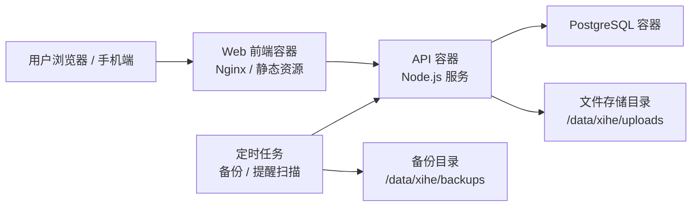

# 羲和阶段 C：部署架构方案

> 目标：为「羲和」从本地原型进入可长期运行的服务器环境做准备。本阶段只规划部署架构，不执行服务器部署。

## 1. 当前判断

羲和目前仍处在单人/小范围试用阶段，核心能力已经从“静态原型”进入“本地可运行产品”：

- 前端：Vite 单页应用，支持移动端优先交互。
- 后端：Node.js API，提供登录、人员、分组、生日提醒、关怀记录、导入导出等能力。
- 数据库：PostgreSQL，本地 Docker 已验证。
- 提醒策略：当前以产品页面内提醒为主；企业微信等外部推送能力先保留接口和配置空间，暂不作为阶段 C 必做项。

因此，阶段 C 不建议一开始引入 Kubernetes、复杂微服务或云原生对象存储。更合适的路线是：

**单台虚拟机 + Docker Compose + PostgreSQL + 本地目录持久化 + 定时备份。**

这条路线简单、可控、成本低，也符合当前“先把产品稳定跑起来”的节奏。

## 2. 部署目标

阶段 C 的部署目标不是追求一次性商业化上线，而是建立一个可持续演进的运行底座：

1. 程序、数据、备份都集中存放在服务器 `/data` 目录下。
2. PostgreSQL 数据可持久化、可备份、可恢复。
3. 前端、API、数据库之间边界清晰。
4. 支持后续扩展图片、文档等非结构化数据。
5. 敏感配置不进入 Git 仓库。
6. 部署步骤可重复，后续可以平滑迁移到更正式的生产环境。

## 3. 推荐部署拓扑



推荐服务拆分：

| 服务 | 职责 | 阶段 C 建议 |
|---|---|---|
| web | 承载前端静态页面 | 使用 Nginx 或轻量静态服务 |
| api | 业务接口、鉴权、提醒计算、导入导出 | Node.js 服务容器 |
| postgres | 结构化业务数据 | Docker volume 或宿主机目录持久化 |
| scheduler | 定时备份、未来提醒扫描 | 先用 cron 或独立容器，暂不复杂化 |
| uploads | 未来图片、文档、附件 | 初期使用本地目录，后续再评估 MinIO |

## 4. 服务器目录规划

用户提供的服务器要求是所有程序、数据、备份文件存放在虚拟机 `/data` 目录下。建议统一放在：

```text
/data/xihe
├── app/                     # 当前部署版本或应用代码
├── releases/                # 后续如需保留历史版本，可放这里
├── config/                  # 生产环境配置，不进入 Git
│   ├── .env.production
│   └── docker-compose.production.yml
├── postgres/                # PostgreSQL 数据目录
├── uploads/                 # 未来图片、文档、头像、附件等非结构化文件
├── backups/
│   ├── postgres/            # pg_dump 数据库备份
│   ├── json/                # 产品内 JSON 导出备份
│   └── config/              # 脱敏后的配置快照
└── logs/
    ├── api/
    ├── web/
    └── scheduler/
```

其中：

- `/data/xihe/postgres` 是核心数据目录，必须纳入备份策略。
- `/data/xihe/uploads` 暂时可以为空，但先预留，便于后续支持图片、文档、头像等能力。
- `/data/xihe/config/.env.production` 存放数据库密码、JWT 密钥、外部推送 webhook 等敏感配置，不同步、不提交。
- `/data/xihe/backups/json` 对应产品内 JSON 导出，不替代数据库备份，只作为业务级可读备份。

## 5. 网络与端口建议

当前服务器信息中，SSH 使用非默认端口。后续部署时建议端口策略如下：

| 用途 | 建议端口 | 暴露范围 |
|---|---:|---|
| SSH | SSH_PORT | 仅管理网络可访问 |
| Web HTTP | 80 或测试端口 | 根据上线范围决定 |
| Web HTTPS | 443 | 正式访问时建议启用 |
| API | 8787 | 优先只在内网或 Docker 网络暴露 |
| PostgreSQL | 5432 | 不建议公网暴露 |

阶段 C 初期可以先使用内网测试访问，例如：

- 前端：`http://服务器IP:前端端口`
- API：由前端通过反向代理访问，避免浏览器直接记住 API 端口。

正式一点的做法是：

```text
浏览器访问 https://xihe.example.com
Nginx / Web 容器代理：
  /      -> 前端静态文件
  /api   -> API 容器
```

## 6. 数据库与备份策略

### 6.1 数据库定位

PostgreSQL 是羲和的主数据源，保存：

- 用户账号与登录信息
- 人员生日信息
- 分组关系
- 提醒任务
- 关怀记录
- 未来的附件元数据

JSON 备份只是产品维度的“可读导出”，不是数据库备份的替代品。

### 6.2 建议备份方式

阶段 C 推荐同时保留两类备份：

| 备份类型 | 工具/来源 | 用途 |
|---|---|---|
| PostgreSQL 备份 | `pg_dump` | 灾难恢复、服务器迁移 |
| JSON 业务备份 | 羲和产品导出接口 | 人工核对、轻量迁移、数据审计 |

建议策略：

- 每日自动执行一次 `pg_dump`。
- 保留最近 7 天每日备份。
- 保留最近 4 周每周备份。
- 重要版本发布前手动执行一次备份。
- JSON 备份可以由后台页面或维护接口手动触发，后续再做自动化。

备份目录建议：

```text
/data/xihe/backups/postgres/xihe_YYYYMMDD_HHMMSS.dump
/data/xihe/backups/json/xihe_export_YYYYMMDD_HHMMSS.json
```

## 7. 非结构化文件存储建议

用户提到后续可能需要图片、文档等非结构化存储。阶段 C 建议先不引入复杂对象存储，采用本地目录：

```text
/data/xihe/uploads
```

后续如果出现以下情况，再考虑 MinIO 或云对象存储：

- 上传文件明显增多。
- 需要多台服务器共享文件。
- 需要独立权限、生命周期、缩略图等能力。
- 需要公网 CDN 或外链访问。

初期推荐数据模型预留：

- 文件 ID
- 原始文件名
- MIME 类型
- 文件大小
- 存储路径
- 所属人员 ID
- 上传用户 ID
- 创建时间

这样未来从本地目录迁移到 MinIO 时，不需要大改业务逻辑。

## 8. 敏感配置与安全边界

阶段 C 需要明确一个原则：

**Git 仓库保存代码和示例配置，不保存真实密钥。**

生产环境真实配置建议放在：

```text
/data/xihe/config/.env.production
```

应包含但不限于：

- 数据库连接串
- JWT 密钥
- Cookie 密钥
- 管理员初始化账号
- 外部推送 webhook
- 备份保留策略

仓库中只保留：

```text
.env.production.example
```

示例配置只写变量名和假值，不写真实密钥。

安全边界建议：

1. PostgreSQL 不暴露公网。
2. API 通过 Web/Nginx 反向代理访问。
3. Webhook 等外部推送密钥只存在服务器配置文件中。
4. 备份文件目录不通过 Web 服务暴露。
5. 后续如开放公网访问，必须启用 HTTPS。

## 9. 阶段 C 部署步骤草案

后续真正执行服务器部署时，建议按以下顺序：

1. 在服务器创建 `/data/xihe` 目录结构。
2. 安装或确认 Docker / Docker Compose 可用。
3. 将当前应用代码同步到 `/data/xihe/app`。
4. 创建 `/data/xihe/config/.env.production`。
5. 创建生产版 `docker-compose.production.yml`。
6. 启动 PostgreSQL 容器。
7. 执行数据库初始化或迁移脚本。
8. 构建并启动 API 容器。
9. 构建并启动 Web 容器。
10. 访问健康检查接口。
11. 创建数据库备份脚本。
12. 配置每日备份定时任务。
13. 做一次完整恢复演练。

其中第 13 步很重要：没有验证过恢复的备份，只能算“看起来像备份”。

## 10. 关键取舍

| 选项 | 当前结论 | 原因 |
|---|---|---|
| 单 VM vs 多服务器 | 先单 VM | 用户规模小，复杂度低 |
| Docker Compose vs Kubernetes | 先 Docker Compose | 部署、排障、迁移都更轻 |
| 本地 uploads vs MinIO | 先本地目录 | 当前还未开始文件上传能力 |
| JSON 备份 vs 数据库备份 | 两者都保留 | JSON 易读，数据库备份可恢复 |
| 企业微信推送 | 暂缓 | 当前产品内提醒已满足下一阶段验证 |
| 后台管理系统 | 后续阶段 | 目前先保证用户端闭环 |

## 11. 阶段 C 建议产出物

接下来可以逐个补齐这些文件：

1. `prototype/infra/docker-compose.production.yml`
2. `prototype/infra/.env.production.example`
3. `prototype/infra/backup-postgres.sh`
4. `prototype/infra/restore-postgres.sh`
5. `prototype/infra/DEPLOYMENT.md`

建议下一步先做：

**生产环境 Docker Compose 草案 + `.env.production.example`。**

这样还不会连接服务器，也不会泄露真实密钥，但能把未来部署的骨架先搭好。

